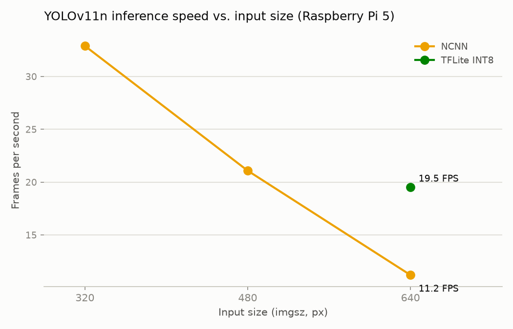

# Edge AI Optimization Benchmark: YOLOv11n on Raspberry Pi 5

Benchmarking YOLOv11n object detection across model formats on a Raspberry Pi
5, comparing inference speed and accuracy trade-offs for edge deployment.
Pretrained COCO weights only — no training was done.

**Status: all four formats — PyTorch, ONNX, NCNN, and TFLite INT8 — are
benchmarked below. Phase 3 (TFLite INT8) is complete.**

## Hardware

- Raspberry Pi 5 Model B, 4 GB RAM, Ubuntu 24.04 LTS (aarch64)
- 4-core CPU, no GPU/NPU acceleration used
- CPU temperature logged before/after each format to catch thermal throttling

## Install

```
python -m venv .venv && source .venv/bin/activate
pip install -e .
```

Or `pip install -r requirements.txt` to run from source without installing
the package. Either way, TFLite inference goes through `ai-edge-litert` —
`tflite-runtime` has no Python 3.12 wheel, and full TensorFlow is too heavy
to install on the Pi, so neither is ever installed here (see requirements.txt).

## Usage

```
yolo-pi-bench benchmark yolo11n.pt --source test.mp4
```

Benchmarks whichever of PyTorch/ONNX/NCNN/TFLite INT8 it finds next to
`yolo11n.pt` (see Method for the naming convention) at 640px, 200 timed
frames with a 20-frame warmup and a 30s inter-format cooldown, then writes
`bench_out/report.md`, `bench_out/fps_chart.png`, and
`bench_out/speed_results.csv` / `accuracy_results.csv`.

Useful flags:
- `--imgsz 320` — inference size (NCNN/TFLite are shape-locked to whatever
  size they were exported at — see `yolo-pi-bench export` and the
  shape-lock note under Method)
- `--formats pytorch,ncnn` — only benchmark formats you've exported
- `--skip-accuracy` — speed only, skips the slower COCO128 `val()` pass
- `--outdir results/` — default is `bench_out/`

`yolo-pi-bench export yolo11n.pt --imgsz 320` exports ONNX + NCNN locally.
TFLite INT8 isn't exportable this way — it needs full TensorFlow, done off-Pi
(see Method step 4); point `--tflite-path` at the copied-back file instead.

Run `yolo-pi-bench benchmark --help` / `yolo-pi-bench export --help` for the
full flag list.

## Method

1. `yolo-pi-bench export yolo11n.pt` converts `yolo11n.pt` to ONNX and NCNN
   using Ultralytics' built-in exporters, run directly on the Pi.
2. `yolo-pi-bench benchmark` loads a fixed set of video frames into memory
   once (so disk I/O doesn't pollute timing), runs a 20-frame warmup per
   format, then times 200 inference calls per format at 640px. A 30-second
   cooldown separates formats so later formats aren't penalized by heat
   carried over from earlier ones. TFLite inference is forced to
   `num_threads=4` (Ultralytics' LiteRT backend otherwise defaults to 1
   thread, leaving 3 of the Pi 5's 4 cores idle — see `litert_num_threads()`
   in `src/yolo_pi_bench/speed.py`).
3. The same `benchmark` run also calls Ultralytics' standard `val()` on
   COCO128 for each format and records mAP50-95, mAP50, precision, and
   recall (skip with `--skip-accuracy`).
4. TFLite INT8: exported in Google Colab (`YOLO("yolo11n.pt").export(format="tflite",
   int8=True)`, calibrated on COCO128) since full TensorFlow is too heavy to
   install on the Pi. The resulting `yolo11n_int8.tflite` was copied back and
   run here through `ai-edge-litert` (the actively maintained successor to
   `tflite-runtime`, published for Python 3.12/aarch64) — no full TensorFlow
   was installed on the Pi, per the project's hardware constraints.
5. NCNN and TFLite bake the input shape into the exported graph — feeding a
   mismatched imgsz to a fixed-shape NCNN model doesn't raise a clean error,
   it corrupts memory and crashes the process. `yolo-pi-bench` handles this
   by resolving NCNN's path as `{model}_ncnn_model_{imgsz}` for any imgsz
   other than 640 (its default export size), so a sweep across sizes needs
   one `yolo-pi-bench export --imgsz N` per size first; TFLite INT8 is only
   attempted at 640 (its one Colab export) unless `--tflite-path` overrides it.
6. Test video: a 54-second, 768x432, 12fps clip containing people, bicycles,
   and cars (public sample footage, not recorded on this Pi — swap in your own
   `test.mp4` and re-run `yolo-pi-bench benchmark` to reproduce with different
   footage).

Everything here is reproducible:
`yolo-pi-bench export yolo11n.pt`, then
`yolo-pi-bench benchmark yolo11n.pt --source test.mp4`. The results below
were captured with this tool's predecessor (flat scripts, since folded into
this CLI) in one continuous session; re-running with the same flags should
reproduce them within normal run-to-run/thermal variance.

## Results: inference speed

| Format | Size (MB) | FPS | Mean latency (ms) | p95 (ms) | Speedup |
|---|---|---|---|---|---|
| PyTorch FP32 | 5.6 | 3.80 | 263.5 | 267.3 | 1.0x |
| ONNX FP32 | 10.7 | 4.74 | 210.8 | 258.9 | 1.25x |
| NCNN | 10.7 | 10.74 | 93.2 | 95.7 | 2.83x |
| TFLite INT8 | 3.1 | 18.53 | 54.0 | 62.2 | 4.88x |


TFLite INT8 is the fastest format tested: 4.88x the PyTorch baseline and
comfortably ahead of NCNN, while also being the smallest file by a wide
margin (3.1 MB vs 10.7 MB for the FP32 exports) — INT8 weights are a quarter
the size of FP32, and XNNPACK's integer NEON kernels convert that into real
latency savings, not just a smaller file. That gap only shows up correctly
with `num_threads=4` on the LiteRT interpreter (see Method); left at
Ultralytics' default of 1 thread, TFLite INT8 measured 10.29 FPS — still
fastest, but understating it by nearly half since 3 of the Pi 5's 4 cores
sat idle. NCNN remains a strong second at 2.83x with zero accuracy cost (see
below). ONNX Runtime's CPU execution provider on ARM64 barely beats
PyTorch — it's not using any ARM-specific kernel optimizations NCNN or
LiteRT have, so the export alone doesn't buy much without a compatible
runtime.

Note: this table was regenerated in one continuous session across all four
formats, so absolute FPS differs from earlier partial runs — the CPU started
each format a few degrees warmer than the original cool-start runs despite
the 30-second cooldowns. Relative ordering is consistent either way; absolute
FPS numbers are sensitive to thermal state at the start of a run.

CPU temperature rose to ~80-85°C over the PyTorch/ONNX/NCNN runs and stayed
lower for TFLite INT8, since it's simply less work per frame. None of the
runs showed throttling-induced slowdown (FPS was stable across each run),
but sustained real-world use (minutes, not tens of seconds) would likely
need active cooling or a duty cycle.

## Results: inference speed vs. input size (imgsz)

| Format | imgsz | FPS | Mean latency (ms) | p95 (ms) |
|---|---|---|---|---|
| NCNN | 320 | 32.90 | 30.4 | 51.9 |
| NCNN | 480 | 21.09 | 47.4 | 54.7 |
| NCNN | 640 | 11.21 | 89.2 | 93.6 |
| TFLite INT8 | 640 | 19.51 | 51.3 | 52.5 |



This sweep is `yolo-pi-bench benchmark yolo11n.pt --imgsz N --formats ncnn`
run once per size, against the per-size NCNN exports below — NCNN is nearly
3x faster at 320 than 640, the expected roughly-quadratic cost of processing
a larger input. TFLite INT8 only appears at 640: both NCNN and TFLite bake the
input shape into the exported graph rather than tolerating a resize at
inference time like PyTorch/ONNX/TFLite-with-dynamic-shapes do, so feeding a
mismatched imgsz to a fixed-shape NCNN model doesn't raise a clean error —
it corrupts memory and crashes the process (`corrupted size vs. prev_size`,
reproduced twice). NCNN sidesteps this by exporting one model per size
(`yolo11n_ncnn_model_320/`, `_480/`, plus the existing 640 export) — cheap,
since it needs no TensorFlow and runs locally. TFLite INT8 export needs full
TensorFlow and happens in Colab (see Method), so re-exporting it at 320/480
just for this chart was out of scope; feeding it a mismatched imgsz raises a
clean `ValueError` instead of crashing, so it's simply skipped rather than
faked.

## Results: accuracy (COCO128, mAP50-95)

| Format | mAP50-95 | mAP50 | Precision | Recall |
|---|---|---|---|---|
| PyTorch FP32 | 0.5044 | 0.6724 | 0.6597 | 0.5932 |
| ONNX FP32 | 0.5051 | 0.6744 | 0.7415 | 0.5598 |
| NCNN | 0.4997 | 0.6756 | 0.7386 | 0.5613 |
| TFLite INT8 | 0.4212 | 0.6091 | 0.6329 | 0.5405 |

ONNX and NCNN are lossless graph conversions of the same FP32 weights, so
mAP50-95 is unchanged within noise (0.504 -> 0.505 -> 0.500, a 0.9% relative
difference). TFLite INT8 is not lossless: mAP50-95 drops from 0.5044 to
0.4212, a 16.5% relative loss (mAP50 drops a smaller but still real 9.4%,
from 0.6724 to 0.6091). This is exactly the tradeoff called out below —
quantizing YOLOv11n's small detection head to INT8 costs real accuracy in
exchange for the 4.88x speedup above, and on this model that cost is not
negligible.

## Quantization and why edge inference differs from Colab

Colab benchmarks (and most published model benchmarks) run on a GPU or a
server-grade CPU with wide SIMD, more cache, and no thermal ceiling. A
Raspberry Pi 5's CPU has none of that: no GPU here, ARM NEON instead of AVX,
much smaller caches, and it throttles under sustained load. So the same model
that hits real-time on a T4 in Colab can be single-digit FPS on a Pi purely
from missing acceleration, independent of INT8 quantization.

INT8 quantization (TFLite) attacks a different problem: even with a good CPU
runtime, FP32 matmuls are still doing 4x the memory bandwidth and no
integer SIMD path. Quantizing weights and activations to INT8 shrinks the
model, cuts memory bandwidth, and lets ARM's integer NEON instructions run
the convolutions, typically 2-4x faster than FP32 on the same hardware. The
cost is precision: rounding weights and activations to 256 discrete levels
loses information, and how much accuracy that costs is architecture- and
calibration-dependent — small detection heads with wide dynamic range can
lose several mAP points.

That prediction held up: TFLite INT8 is the fastest format measured (4.88x
PyTorch) but also the only one with a real accuracy cost, losing 16.5%
relative mAP50-95. Whether that trade is worth it depends on the deployment
— a coarse presence/absence detector can probably absorb it, a system relying
on tight box localization probably can't.

## Files

- `src/yolo_pi_bench/` — the `yolo-pi-bench` CLI package
  - `cli.py` — argparse entry point, `benchmark` and `export` subcommands
  - `formats.py` — format labels/colors and model-path resolution by naming convention
  - `speed.py` — FPS benchmark (frame loading, warmup/timing, the LiteRT thread-count fix)
  - `accuracy.py` — COCO128 mAP validation across formats
  - `chart.py` — builds the FPS bar chart (matplotlib, `Agg` backend)
  - `report.py` — writes the CSVs and the markdown report
- `pyproject.toml` / `requirements.txt` — package metadata and pinned dependencies
- `results.md` / `results.csv`, `accuracy.md` / `accuracy.csv`, `sweep.md` / `sweep.csv`,
  `fps_chart.png`, `sweep_chart.png` — the checked-in results below, from the run described
  in Method; `yolo-pi-bench benchmark` writes fresh runs to `bench_out/` (gitignored) instead
  of overwriting these
- `test.mp4` — test video used for speed benchmarking
- `yolo11n.pt` — pretrained COCO weights (not trained/fine-tuned here)
- `yolo11n.onnx` / `yolo11n_ncnn_model/` — exported with `yolo-pi-bench export` on the Pi (640px)
- `yolo11n_ncnn_model_320/` / `_480/` — NCNN exports at those imgsz, for the sweep only
- `yolo11n_int8.tflite` — INT8 export, done in Google Colab (not on the Pi) and copied in
