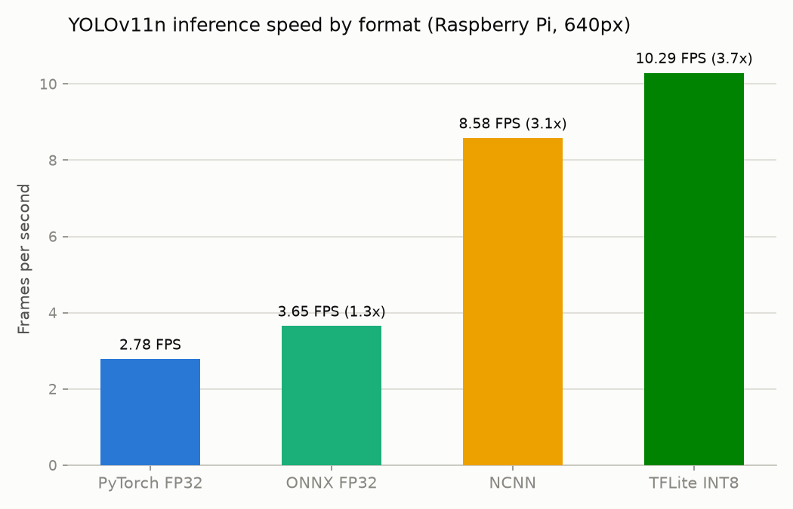

# Edge AI Optimization Benchmark: YOLOv11n on Raspberry Pi

Benchmarking YOLOv11n object detection across model formats on a Raspberry Pi
5, comparing inference speed and accuracy trade-offs for edge deployment.
Pretrained COCO weights only — no training was done.

**Status: all four formats — PyTorch, ONNX, NCNN, and TFLite INT8 — are
benchmarked below. Phase 3 (TFLite INT8) is complete.**

## Hardware

- Raspberry Pi 5 Model B, 4 GB RAM, Ubuntu 24.04 LTS (aarch64)
- 4-core CPU, no GPU/NPU acceleration used
- CPU temperature logged before/after each format to catch thermal throttling

## Method

1. `export_models.py` converts `yolo11n.pt` to ONNX and NCNN using Ultralytics'
   built-in exporters, run directly on the Pi.
2. `benchmark.py` loads a fixed set of video frames into memory once (so disk
   I/O doesn't pollute timing), runs a 20-frame warmup per format, then times
   200 inference calls per format at 640px. A 30-second cooldown separates
   formats so later formats aren't penalized by heat carried over from earlier
   ones.
3. `accuracy.py` runs Ultralytics' standard `val()` on COCO128 for each format
   and records mAP50-95, mAP50, precision, and recall.
4. TFLite INT8: exported in Google Colab (`YOLO("yolo11n.pt").export(format="tflite",
   int8=True)`, calibrated on COCO128) since full TensorFlow is too heavy to
   install on the Pi. The resulting `yolo11n_int8.tflite` was copied back and
   run here through `ai-edge-litert` (the actively maintained successor to
   `tflite-runtime`, published for Python 3.12/aarch64) — no full TensorFlow
   was installed on the Pi, per the project's hardware constraints.
5. Test video: a 54-second, 768x432, 12fps clip containing people, bicycles,
   and cars (public sample footage, not recorded on this Pi — swap in your own
   `test.mp4` and re-run `benchmark.py` to reproduce with different footage).

Everything here is reproducible: `python export_models.py`, then
`python benchmark.py --source test.mp4`, then `python accuracy.py`.

## Results: inference speed

| Format | Size (MB) | FPS | Mean latency (ms) | p95 (ms) | Speedup |
|---|---|---|---|---|---|
| PyTorch FP32 | 5.6 | 2.78 | 359.2 | 420.3 | 1.0x |
| ONNX FP32 | 10.7 | 3.65 | 273.9 | 346.9 | 1.31x |
| NCNN | 10.7 | 8.58 | 116.5 | 172.1 | 3.09x |
| TFLite INT8 | 3.1 | 10.29 | 97.2 | 100.8 | 3.7x |

TFLite INT8 is the fastest format tested: 3.7x the PyTorch baseline and
noticeably ahead of NCNN, while also being the smallest file by a wide margin
(3.1 MB vs 10.7 MB for the FP32 exports) — INT8 weights are a quarter the
size of FP32, and XNNPACK's integer NEON kernels convert that into real
latency savings, not just a smaller file. NCNN remains a strong second at
3.09x with zero accuracy cost (see below). ONNX Runtime's CPU execution
provider on ARM64 barely beats PyTorch — it's not using any ARM-specific
kernel optimizations NCNN or LiteRT have, so the export alone doesn't buy
much without a compatible runtime.

Note: this table was regenerated in one continuous session across all four
formats, so absolute FPS for PyTorch/ONNX/NCNN differ slightly from earlier
partial runs (baseline PyTorch dropped from 3.69 to 2.78 FPS) — the CPU
started each format a few degrees warmer than the original cool-start runs
despite the 30-second cooldowns. Relative ordering and speedup factors are
consistent either way; absolute FPS numbers are sensitive to thermal state
at the start of a run.

CPU temperature rose to ~80-85°C over the PyTorch/ONNX/NCNN runs and stayed
lower (~75°C) for TFLite INT8, since it's simply less work per frame. None of
the runs showed throttling-induced slowdown (FPS was stable across each
run), but sustained real-world use (minutes, not tens of seconds) would
likely need active cooling or a duty cycle.

## Results: accuracy (COCO128, mAP50-95)

| Format | mAP50-95 | mAP50 | Precision | Recall |
|---|---|---|---|---|
| PyTorch FP32 | 0.5044 | 0.6724 | 0.6597 | 0.5932 |
| ONNX FP32 | 0.5051 | 0.6744 | 0.7415 | 0.5598 |
| NCNN | 0.4997 | 0.6756 | 0.7386 | 0.5613 |
| TFLite INT8 | 0.4212 | 0.6091 | 0.6329 | 0.5405 |

ONNX and NCNN are lossless graph conversions of the same FP32 weights, so
mAP50-95 is unchanged within noise (0.504 -> 0.505 -> 0.500, a 0.9% relative
difference). TFLite INT8 is not lossless: mAP50-95 drops from 0.5044 to
0.4212, a 16.5% relative loss (mAP50 drops a smaller but still real 9.4%,
from 0.6724 to 0.6091). This is exactly the tradeoff called out below —
quantizing YOLOv11n's small detection head to INT8 costs real accuracy in
exchange for the 3.7x speedup above, and on this model that cost is not
negligible.

## Quantization and why edge inference differs from Colab

Colab benchmarks (and most published model benchmarks) run on a GPU or a
server-grade CPU with wide SIMD, more cache, and no thermal ceiling. A
Raspberry Pi's CPU has none of that: no GPU here, ARM NEON instead of AVX,
much smaller caches, and it throttles under sustained load. So the same model
that hits real-time on a T4 in Colab can be single-digit FPS on a Pi purely
from missing acceleration, independent of INT8 quantization.

INT8 quantization (TFLite) attacks a different problem: even with a good CPU
runtime, FP32 matmuls are still doing 4x the memory bandwidth and no
integer SIMD path. Quantizing weights and activations to INT8 shrinks the
model, cuts memory bandwidth, and lets ARM's integer NEON instructions run
the convolutions, typically 2-4x faster than FP32 on the same hardware. The
cost is precision: rounding weights and activations to 256 discrete levels
loses information, and how much accuracy that costs is architecture- and
calibration-dependent — small detection heads with wide dynamic range can
lose several mAP points.

That prediction held up: TFLite INT8 is the fastest format measured (3.7x
PyTorch) but also the only one with a real accuracy cost, losing 16.5%
relative mAP50-95. Whether that trade is worth it depends on the deployment
— a coarse presence/absence detector can probably absorb it, a system relying
on tight box localization probably can't.

## Files

- `benchmark.py` — speed benchmark across formats, writes `results.csv`/`results.md`
- `export_models.py` — ONNX + NCNN export
- `accuracy.py` — COCO128 mAP validation across formats, writes `accuracy.csv`/`accuracy.md`
- `make_chart.py` — builds `fps_chart.png` from `results.csv`
- `test.mp4` — test video used for speed benchmarking
- `yolo11n.pt` — pretrained COCO weights (not trained/fine-tuned here)
- `yolo11n.onnx` / `yolo11n_ncnn_model/` — exported by `export_models.py` on the Pi
- `yolo11n_int8.tflite` — INT8 export, done in Google Colab (not on the Pi) and copied in
